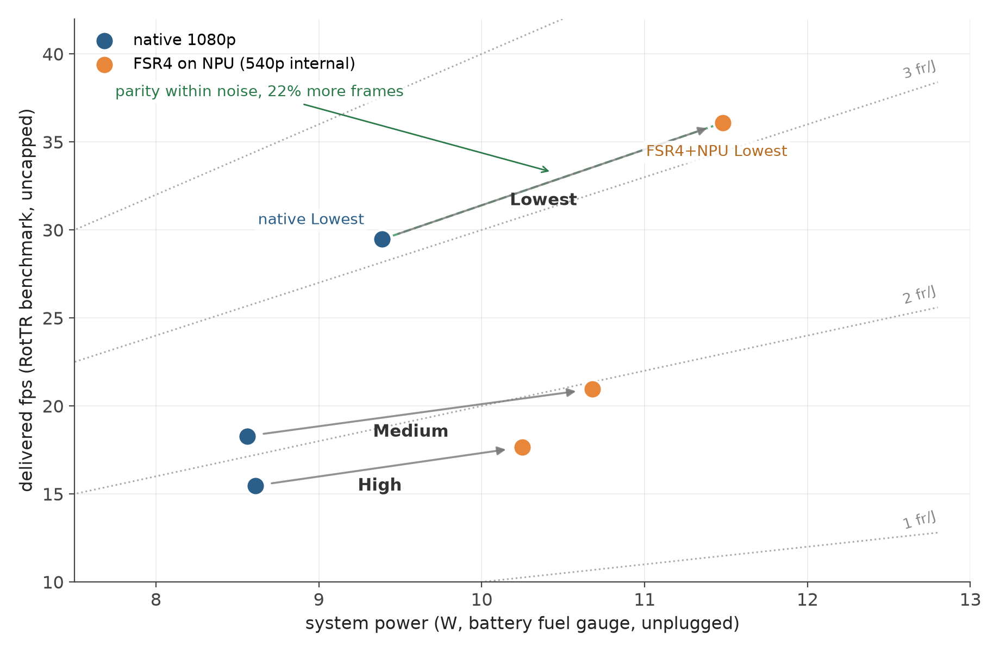
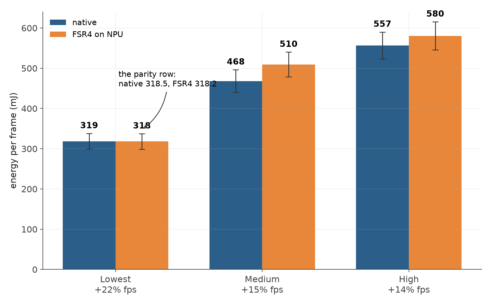
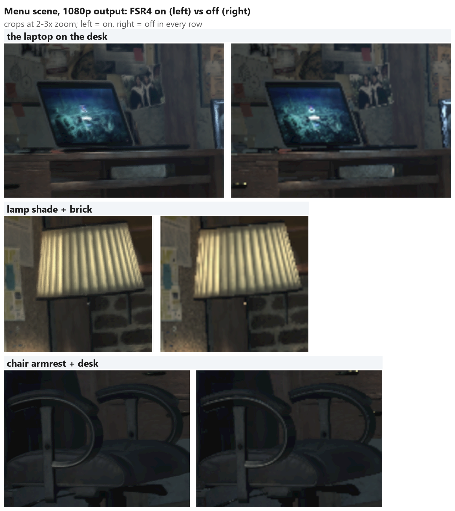
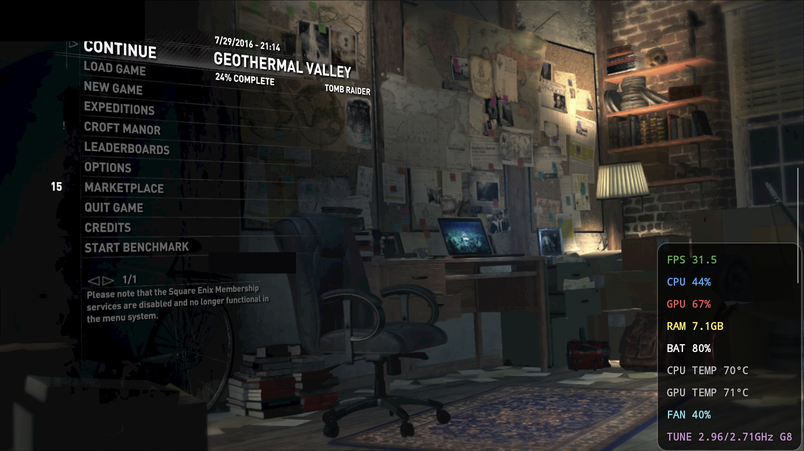
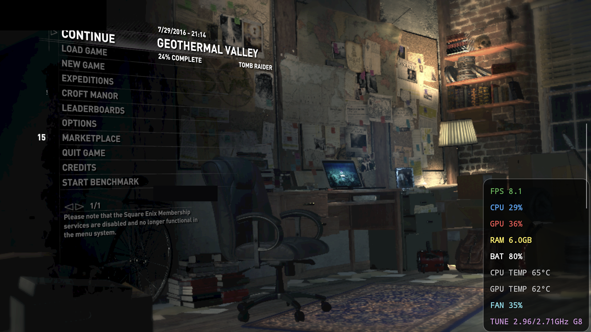
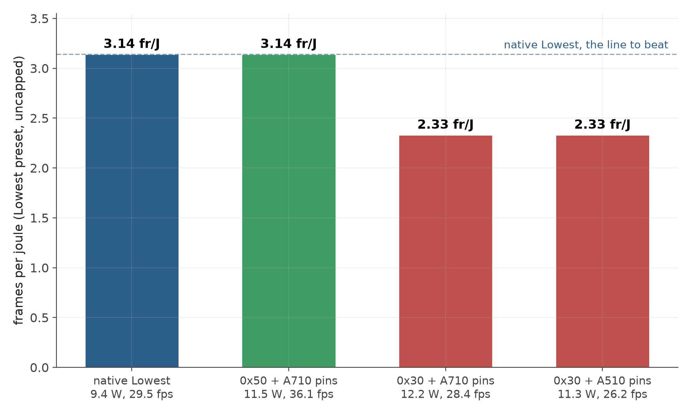
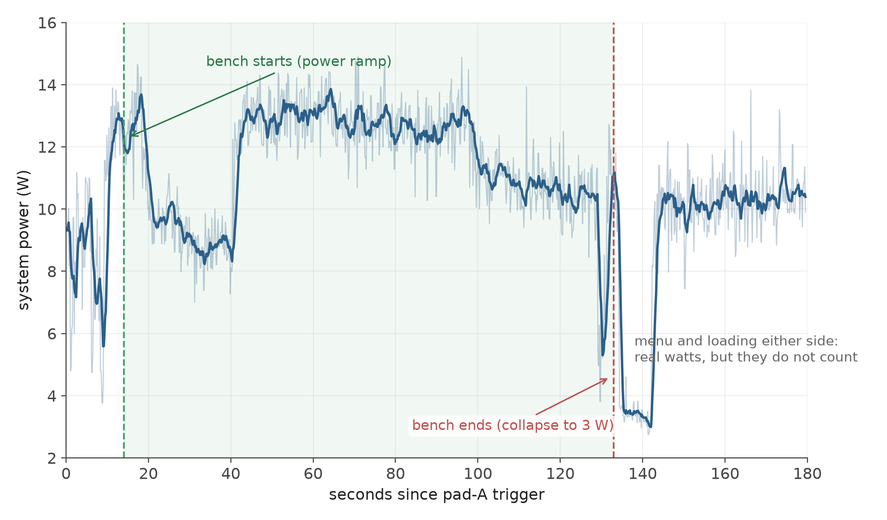

# FSR4 on a Phone NPU: The Retroid Pocket 6 DLSS Heist

*An open-source teardown of intercepting DLSS calls and running AMD's FSR4 on the Hexagon NPU of an Android handheld, written by someone who should have gone to bed hours ago.*

If you only want the numbers, skip to the tables. Contact and support details are at the bottom. If you want to know what it feels like to debug a Wine container at 1am, welcome.

---

## Who I am and why should you care

I'm not Gamers Nexus or Hardware Unboxed. No lab, no capture rig worth the name. My power analyzer is a sysfs file the kernel gives away for free. I'm a Kiwi nerd poking around under the hood of ARM silicon to see what happens when you push it, and I love pushing tiny energy-efficient silicon. Something about taking a handheld with an actual fan in it and asking "but what if the neural engine did the upscaling" and then not sleeping until it does.

This started as a hobby project that got badly out of hand: me reverse engineering stuff, reading a lot of code written by people smarter than me, and finding out how much performance you can wring out of a mobile NPU. Nobody paid for this. It's spite and curiosity, call it 60/40 spite.

---

## The stupid idea, stated plainly

Rise of the Tomb Raider on the Retroid Pocket 6 asks an `nvngx.dll` for DLSS upscaling. NVIDIA's DLSS, on an Adreno GPU, under Wine, on Android. A round hole and a very square peg.

So we replaced the peg.

A proxy `nvngx.dll` sits in the game folder and pretends to be NVIDIA. The game hands it the per-frame inputs DLSS wants (color, motion vectors, jitter, the works) at a stable versioned API. The proxy ships those frames over TCP loopback to a native ARM64 daemon, and that daemon runs **AMD FSR4**, quantized to W8A8 (8-bit weights, 8-bit activations), on the Snapdragon's Hexagon NPU. The upscaled frame comes back and gets written into the game's output texture. The game never knows. NVIDIA never knew.

---

## The NPU unlock, or: the part where the handheld fights back

What makes this project slightly unhinged: **the NPU on the Retroid Pocket 6 is disabled on purpose.** Everything needed for it ships on the device. The CDSP firmware sits in the modem partition, the remoteproc drivers are in the vendor tree, and TrustZone will happily authenticate the DSP (proven live). But on every boot, a component in the secure boot chain finds the CDSP node in the device tree (`/soc/remoteproc-cdsp@32300000`) and flips its status from "ok" to "no", so Linux never brings the DSP up. Retroid shipped a full 8 Gen 2 NPU and then turned it off at the door.

The unlock ([rp6-npu-unlock](https://github.com/puzzled-pancake/rp6-npu-unlock), open source, no root, just an unlocked bootloader) goes around the flipper rather than through it. A dtbo overlay adds a complete clone of the CDSP node under a new name, `hexagon-npu@32300000`. The flipper is path-keyed and never touches the clone, so its `status = "ok"` survives boot. The vendor's own CDSP loader gets retargeted to the clone. One catch: the bootloader renumbers phandles when it applies the overlay, so the build tool has to bake the renumbered value in before flashing. After that the vendor's loader does everything itself. It boots the DSP, pulls the firmware from the modem partition through ueventd's fallback path, and by 3.4 seconds after power-on the remoteproc reads `running`, with the fastRPC channel and QNN sessions coming up right behind it. No firmware dumped, nothing proprietary redistributed. The device tree just lies very politely about its identity. There's a marker-first flash procedure so you can verify the phandle math on your own build before enabling anything, and since the RP6 doesn't do fastboot at all, every flash happens in EDL mode.

Then there's a second, smaller fight in userspace before anything will talk to the NPU. Bundle the QNN libraries yourself, Skel and all, but do NOT bundle `libcdsprpc.so`: the vendor-public copy in `/vendor` is the one the FastRPC channel wants, and mine sulked until I used it. Past that it's the usual ritual. `ADSP_LIBRARY_PATH` before the first QNN load, a DCVS vote so the Hexagon doesn't nap between frames, allocations through rpcmem, GL on an EGL pbuffer. The unlock repo's testing notes also cover running LLMs on the unlocked Hexagon, if tiny models on tiny silicon are your thing.

---

## How it actually works

The one-paragraph version is above. Here's the long version, because the details are where the project lives.

**Getting pixels out of the game.** Each eval, the proxy copies the game's color and motion vector textures into cached staging textures and Maps them. That Map is a full GPU sync, and on this stack a naive one cost 35ms a frame at the start. The first fix was deferring it: every eval queues its copies and processes the previous eval's, whose GPU work finished a frame ago, riding a 3-entry ring. That alone took evals from as high as the forties down to the teens and twenties; moving the decode work off the game thread took them to about 3.

**The wire.** TCP loopback with a small versioned protocol. Color crosses as the game's raw R11G11B10F bits with no decode on the game thread, motion vectors as float rows with a length-tagged tail carrying jitter and MV scale, and the response comes back as RGBA8. The proxy keeps three frame slots with two requests in flight. The original protocol was lock-step per request, so transport and compute could never overlap no matter how many threads I threw at it. Length tags discriminate versions, so an old proxy still talks to a new daemon.

Yes, a socket is a boring answer, and I priced the exotic ones. AF_UNIX never made it into Wine's socket stack, passing file descriptors through ws2_32 does not exist at all, and the one shared-memory scheme left standing on an unrooted device, an mmap'd ring on a real file, lands on f2fs and works out to about 1.3TB of flash writes per hour of play. Meanwhile the receive jitter that looked like the TCP copy tax turned out to be scheduler lateness, which core pinning fixed outright. The wire costs real watts, but it is not the critical path at 30fps, or even 50. The boring socket stays. What pipelining does cost is latency, and the Limitations section owns that number.

**The daemon.** Four threads with pinned cores: a net thread that receives and converts, the GL thread running the feature and post shaders, a dedicated NPU thread whose only job is graphExecute, and a sender. Splitting the NPU out is what lets post-processing of frame N-1 overlap the NPU running frame N, which is how the NPU's 8 to 17ms of execute time (voltage corner dependent) mostly vanishes from the frame budget. The QNN side loads a pre-serialized HTP context once, talks FastRPC through the vendor's own libcdsprpc, and holds a DCVS vote.

**The GPU side, and why the first conv lives there.** The Adreno runs three GLES compute passes. The fused feature shader builds the model's 7-channel mu-law (log-companded) feature tensor and folds the first stride-2 convolution plus the int8 quantization into the same dispatch. postA decodes the NPU output and applies the learned blend between the Gaussian-upscaled current frame and the reprojected history while rewriting the recurrent state. rcas is FSR's final sharpen, ported line for line from AMD's. That first conv stays on the GPU for a better reason than convenience: the temporal state it consumes, history, recurrent color, the low-res frame and the motion vectors, is about 35MB a frame living in GPU memory, and GL on this driver has no dma-buf export. Keeping the cross-engine tensor small and int8 is the entire architecture trick. Offline the fused pass costs about 7.5ms, postA about 3, rcas about 2.

**Temporal state.** The DLSS API hands you color, motion vectors, jitter and exposure, but no reprojection, because NVIDIA's reference builds that internally. So the pipeline synthesizes the history warp from the MVs every frame, and the recurrent state is a texture that postA rewrites and the feature shader then samples. The model genuinely accumulates detail over frames instead of upsampling each frame in isolation. There's also a cut detector, a fraction-of-screen-moving test that resets history on scene cuts so transitions don't smear for half a second. Getting history feedback actually running, rather than silently sampling a frozen seed, which is what it did for an embarrassingly long time, was one of the bigger bugs of the project.

**The zero-copy bridge.** The NPU's output tensor lives in a gralloc AHardwareBuffer. The backing dma-buf fd is sniffed out of /proc/self/fd, registered with QNN as ION memory (the DMA_BUF mem type segfaults inside libQnnHtp, ask me how I know), and attached to GL as an EGLImage. The post shader reads the NPU's bytes straight out of the buffer with imageLoad, and the 16.6MB per frame copy that used to bridge the two engines is gone, bit-exactly. The write direction is the opposite story: I built the same bridge for the input tensor, it was byte-perfect, and it was about 3ms slower on the fence stage, 2.4 net, because writes through the gralloc path don't combine. Ablating across the whole pipeline gives a rough law. Reads are free, writes cost 10x. You only learn that by building both directions and hashing the bytes.

**Per-resolution builds.** The network is fully convolutional, so the 720p arm is a genuinely separate build: the ONNX reshaped to 640x360 input, requantized and prepared as its own context binary (2.8ms per inference, better than linear scaling because the working set fits better in VTCM), with the DLL, daemon and shaders all parameterized on dims. If you want to know how much fun parameterizing every literal in a proxy this size is, see the war story about the two 960s.

**Getting the game to call DLSS at all** takes three lies working together: fakenvapi's nvapi64.dll in the game dir so the NVIDIA API resolves, a dxvk.conf entry spoofing an NVIDIA GPU so the settings menu deigns to show a DLSS toggle, and an injector DLL force-writing `DLSS = 1` into the game's registry on every boot. None of it is optional. On a fresh container the in-game toggle reverts itself before the feature is even created, and the old install only ever worked because a registry value from the first enable had been coasting along unnoticed.

---

## The bit-exactness obsession

Every optimization in this project shipped behind a gate: the modified pipeline had to produce byte-identical output to the reference, or explain itself with md5s. Input frames, feature tensors, outputs, hashed and compared. When a compiler FMA contraction moved 99.8% of texels by exactly one quantum each, that optimization got rejected. Rejected, for one quantum apiece. That's the level of pedantry on display here, and it's also why the numbers below are trustworthy: the thing being measured is provably the same image-producing pipeline, just moved around the SoC.

The gates mostly run without the game at all. A bench client replays synthetic frames with a constant one-to-two-pixel pan, because garbage MVs make the history gather skip texels and the timing lies low. The sharpest check is md5-ing the NPU's own input tensor rather than the final image, and when a cost refuses to move, null-dispatch ablations switch stages off one at a time until the milliseconds confess where they live.

There's also a sentinel shader that reads 64 deterministic texels of the NPU output every 64th frame and compares them against a memory-mapped copy, watching for the day a driver silently hands us a stale frame. It has never fired. I check on it like a new parent.

---

## How I measured things

So you can judge the methodology before you trust the tables.

Power comes from the battery fuel gauge: voltage times current, both read from `/sys/class/power_supply/battery` by an on-device sampler polling about eight times a second, trapezoid-integrated over the bench window. (My first rig was a host-side script reading the gauge at roughly 1.5Hz over WiFi. It got superseded. The gauge itself updates slower than either, so this is overkill either way.) The device must be unplugged, because charging current flows through the same gauge, and measuring that is how you publish exciting fiction. One environment note: GameNative's power control pins cpufreq policies during play. That is part of the platform and identical across every arm here, but it means the absolute watts are not stock-scheduler numbers.

A note on cooling, because it's easy to assume otherwise: the RP6 is not a passive slab slowly cooking itself. It has a real fan, and during these benches it is doing real work. The fan runs off the same battery as everything else, so its watts are inside every number in this paper. The platform telemetry does log cpu and gpu temps, and I watched them live through the benches: gpu peaked at 83C, cpu in the high seventies to low eighties, and nothing throttled mid-run. What that does not settle is heat soak past the bench windows, including whether the 0x50 corner would hold through half an hour of sustained play. The throttling epic is still another weekend.

Frames are counted from the platform's own 2Hz telemetry, GameNative's `powercontrol` metrics log, integrating the fps field over the exact bench window and never trusting an fps cap to cap. Small trap for anyone reproducing this: the log's `totalFrameCount` field turned out to be a sliding window, not an odometer, so the fps field is the only thing worth integrating.

The carve rule, concretely: the window starts where power leaves the loading-screen baseline and ramps, and ends at the first sample under 7.5W after that ramp, or at the dead-flat return to a locked 30.0fps when the menu draws the same watts as the bench tail. Loading screens are excluded on purpose. They're cap-held and they pollute energy per frame differently per config. Two sanity checks gate every cut: the frame count has to land in the roughly 2000-2700 frame range this time-driven bench delivers, and the mean fps has to sit inside the band the other runs already established, which is the binding check. When the power trace and the fps trace disagree, the fps side wins. One cut deserves its confession: the native High tail had a 15-second span that could have been bench or results screen; it was cut at the early edge, and that slop is on the order of the High premium, which is one more reason the premium column is suggestive.

Every number below is one bench run unless stated, and one died and was redone (a DLSS-High attempt that got unplugged mid-window), while an early cut that swallowed loading seconds was re-cut from the same trace. The error band comes from one honest repeat, native 1080p twice on the same day (the pair also crossed containers, and one leg is the corrupted-render run from Limitations, drawing identical watts; that is exactly why power gets to claim 0.1% and fps does not), which agreed to 0.1% on power but drifted 1.6fps on mean fps. Treat every per-frame energy number as plus or minus six percent. One precision worth having: the power side repeated to 0.1%, so that six percent is almost entirely fps-side drift. It's a statement about the platform's 2Hz frame telemetry, not the fuel gauge. Anyone wanting tighter numbers here should count frames harder, not build a better power rig.

For anyone rerunning this: QNN SDK 2.50 talking to an HTP v73 on Android 13, the game is the Steam build of Rise of the Tomb Raider (appid 391220) inside GameNative v1.2.x (installed 1.2.0, self-updated to 1.2.1 mid-project) with its DXVK 2.7.1 and Turnip stack, and the daemon and proxy DLL builds I measured are pinned by md5 in the repo. The model is the fsr4 v07 network out of FidelityFX SDK 2.0.0, re-partitioned so pass0 lives in my shader. The CDSP firmware is whatever Retroid ships in the modem partition, fetched untouched by the vendor's own loader.

---

## The benchmarks

### Experiment 1: everything capped at 30fps

Does the upscaler save energy per frame if both configs only want 30fps? No. And the reason why is the good part.

| Config | Power | fps | mJ per frame |
|---|---|---|---|
| 1080p native | 8.8 W | 24.1 | 365 |
| 1080p, 540p internal, FSR4 on NPU | 11.6 W | 28.2 | 410 |
| 720p native | 8.2 W | 28.2 | 291 |
| 720p, 360p internal, FSR4 on NPU | 9.3 W | 29.2 | 319 |

At a fixed cap, native is cheaper per frame at both resolutions, by 10 to 12 percent. The NPU pipeline costs real watts; it's a whole second computer running next to your game. Look at the fps columns at 1080p, though. Native couldn't hold the cap. 24fps, sad. The pipeline held 28. The cap was hiding the real story.

A config note on this table: both FSR4 rows ran the 0x30 NPU voltage corner, which won its own capped A/B at the 30 lock (about 3.5% less power, roughly 4% less energy per frame, at the same framerate; the uncapped ladder in Experiment 3 crowns 0x50 instead), while the uncapped performance sweep below runs 0x50. The cap itself is GameNative's per-game frame limiter. Also, the native rows were measured on a freshly reinstalled container and the FSR4 rows on the older one. I bridged that by re-running one native arm on both and matching power to 0.1% (8.79 vs 8.80W; one calibration point, but watts are the side that needed bridging), so the energy rates transfer and the fps side just carries the usual variance. And since the corner differs from the uncapped tables below, treat the two experiments as neighbors, not one continuous dataset.

### Experiment 2: take the cap off

Now each config runs flat out, and we measure frames per joule, the metric that answers "is this worth it."

**1080p, three graphics presets:**

| Preset | Native | FSR4 on NPU | What you get |
|---|---|---|---|
| Lowest | 29.5 fps @ 9.4 W, 3.14 fr/J | 36.1 fps @ 11.5 W, 3.14 fr/J | +22% fps, parity within noise |
| Medium | 18.3 fps @ 8.6 W, 2.14 fr/J | 21.0 fps @ 10.7 W, 1.96 fr/J | +15% fps, 9% efficiency premium |
| High | 15.5 fps @ 8.6 W, 1.80 fr/J | 17.7 fps @ 10.3 W, 1.72 fr/J | +14% fps, 4% efficiency premium |

High's 4% sits inside the error band, Medium's 9% just outside, and neither has repeats behind it. I wouldn't quote them as findings. The fps gains are the load-bearing half of those rows.

*The six uncapped preset arms on one chart. Dotted diagonals are constant frames-per-joule. The green dashed pair is the Lowest preset: riding native's diagonal, further along it.*

The Lowest row is the money shot. Per frame energy: 318.5 mJ native, 318.2 mJ with the whole NPU pipeline running. That's 0.1% apart, and it needs its caveat spelled out, because this is the number people will quote: both points carry the error band, so the defensible claim is that the pipeline is indistinguishable from native per-frame energy at this sample size, not proven-equal to it. Two point estimates landing close can still hide a few percent either way; only repeats would narrow that, and repeats are the obvious follow-up. Read conservatively, the row still says every extra watt the pipeline burns converts into frames at native rates, 22% more of them. I did a lap of the living room when the number came out anyway. Statistics arrived for the victory lap later.

*Energy per frame by preset. Error whiskers are the measured plus-or-minus 6 percent band. The Lowest pair is the parity row.*

The native column on its own is worth a look too: same ~8.6W at Medium and High while fps drops from 18.3 to 15.5. The GPU saturates and stops converting watts into frames. That wall is what the offload is for.

Footnote on the fps columns: these runs were measured on a freshly reinstalled container, and they sit below the 48-50fps this same stack hit in its earlier incarnation, pre-reinstall. Container state is worth up to a dozen fps: the production-config Lowest capture's own trace contains a second, warmed-up pass of the bench running at roughly 49fps on about 10.4W against the cold first pass at 36.1fps and 11.5W. So compare rows within a table, where everything ran back to back, and treat the historical number as the stack's demonstrated ceiling.

Caveat: even at Lowest, the heavy scenes sit in the low twenties, geometry and Box64-bound. Native craters there too (18-21fps). The upscaler moves pixels, not x86 emulation: headroom where the GPU was choking, nothing where the CPU was.

---

### Image quality: the part the tables can't hold

The menu background doubles as a free A/B test: it renders the same frame either way, and with the upscaler on it runs the full pipeline, which is why the menu draws 8-10W. The comparison below crops the same camera frame out of both states. With FSR4 on, the laptop screen keeps its content, the lamp shade's pleats stay separated, and the chair rims hold a clean edge. With it off, the same frame is somehow softer and noisier at once: the corkboard's text masses smear, high-contrast edges crawl. The menu's 2D text is the same glyphs both ways, byte-equal wherever the animated background isn't bleeding through the anti-aliasing. The variance of a plain 3x3 Laplacian runs 26 to 44 percent higher on the FSR4-on frames, and since RCAS sharpening alone can add tens of percent of edge energy, those numbers credit the sharpening pass, not the network. Some of the off image's apparent detail is aliasing shimmer, the only compliment it pays itself. Honest caveats: one dark menu scene, not a shoot-out; the on path carries RCAS sharpening at 0.5; the whole rig is my eyeballs plus one Laplacian metric. But as first evidence that the W8A8 graph isn't wrecking the image behind my back, it will do, and the proper fp16-versus-int8 shoot-out is still queued. Both full screenshots are embedded below and ride along in the repo so you can zoom around them yourself; the corkboard's text-mass smear and the shelf skull going soft live there, outside these three crops.

*Same menu frame, 1080p output, crops at 2-3x. Left is FSR4 on the NPU, right is the game with it off. The laptop screen and the chair rims are the easiest tells.*

*The full frame, FSR4 on. Steam name blacked out so people don't add me and find out how many hours I have on Rust.*

*And with it off. Same camera, same save, 75 minutes apart. Softer, noisier, and the aliasing on the chair rims is doing its best impression of detail.*

### Experiment 3: the config space, or: I turned the voltage down and it used more power

The NPU talks to a voltage corner API, so we built a little grid at Lowest preset, uncapped, same pipeline in three configurations:

| Config | Power | fps | fr/J |
|---|---|---|---|
| 0x50 corner, FSR thread on an idle mid core | 11.5 W | 36.1 | 3.14 |
| 0x30 corner (floor voltage), same pins | 12.2 W | 28.4 | 2.33 |
| 0x30 corner, everything on the little cores | 11.3 W | 26.2 | 2.33 |

*Frames per joule for the three pipeline configs against the native line.*

Yes, the middle row. Lower NPU voltage, higher total system power. The NPU runs 6.5ms slower per inference at the floor corner, every frame stretches out, all the waiting threads and held-up clocks burn more than the voltage saved. Duration beats voltage. A scoping note on the third row, since it changes two things at once (corner and core placement): it answers a different question, can smarter pinning rescue the floor corner (no), not the voltage story itself. That's rows one and two, which change exactly one thing. Both 0x30 configs landed on 2.33 fr/J to two decimals, from opposite directions, which is either convergent evidence or a coincidence I don't deserve. The production config is 0x50 with the FSR thread on a mid big core.

Since "a core the game forgot about" is not a reproducible setting, the pin map: the game sits on cores 4 through 7, so the daemon's GL thread takes cpu3, the socket thread cpu0, the sender cpu1, the NPU thread cpu2, NPU voltage corner at 0x50.

*One raw capture. The shaded span is what counts. Everything either side is menu and loading, which draws real watts but belongs to nobody.*

---

## War stories

Every number above has a story, and most of the stories are me being wrong in interesting ways.

**The port that wasn't.** An entire afternoon of "the daemon isn't connected, the pipeline is down, we're doomed" while grepping for connections on port 54345. The daemon listens on 48620. The benchmark tool I was also looking at uses 54345. I searched the wrong port for hours and nearly re-ran a long measurement over it.

**The potato-vision incident.** The 720p energy arm refused to work: menu at 20fps, DLSS "not on", everything falling back to a CPU bilinear that looked like a potato. My DLL copy was perfect. The daemon was perfect. The problem was two hardcoded 960/540 checks in one source file that I missed when parameterizing the build for 360p. Two numbers. Found them at stupid o'clock, fixed, and 30 seconds later the pipeline lit up.

**The DLSS menu that refused to exist (again).** A container reset, long story, also my fault, wiped the game install's ecosystem: the fake-nvapi DLL, the registry patcher, the GPU spoof config. Rebuilding that chain meant reading my own runbook like it was written by a stranger, and discovering that the game's DLSS menu toggle had never worked on a fresh install. The old container was just coasting on a registry value saved from the first ever enable. The fix was making the injector DLL force-write "DLSS = on" into the game's registry on every boot. Negotiations were short.

**The X3 fight.** The first High-preset DLSS attempt looked miserable and I blamed everything except the obvious. Then we mapped the core topology: the game was pinned to cores 4-7, and all four daemon threads were pinned inside that same set, with the FSR render thread on the X3 prime core, elbow to elbow with the game's main thread. There was an idle 2.8GHz mid core sitting right there the whole time. Moved everything, and the GPU fence wait dropped from 21.6ms to 8.0ms. That map is the one printed under Experiment 3, and it's what production runs today.

**The menu that draws 8 to 10 watts.** Idle measurement note for anyone reproducing this: with the pipeline live, the game's main menu draws 8-10W, because the menu background runs the full NPU upscaler. The first time I saw a "resting" number that high I thought the fuel gauge was broken. The fuel gauge was fine. The menu was benching.

---

## What this proves

So, the scoreboard. A shipping game asked for DLSS and got AMD's model off a Hexagon NPU instead, with the bytes hashed end to end, on a retail handheld, and nothing in the chain complained. At the light end the offload is basically free: energy per frame indistinguishable from native inside the noise band, 22% more frames. At the heavy end the efficiency cost sits somewhere inside-to-near the noise band, buying 14% more frames. And every "just undervolt it" config lost, because dragging each frame out an extra 6.5ms burns more juice across the whole SoC than the voltage cut saves. Duration beats voltage. Worth saying twice.

The three DLLs sitting in the game folder between them contain a registry patcher, an NVIDIA impersonator and a TCP client, which is more personality than most software ships with.

---

## Limitations, stated plainly

- **One device, one game, one benchmark.** Everything here is a single Retroid Pocket 6, one game, and the game's own three-scene benchmark. None of the method is RotTR-specific, but nothing here has been replicated on a second anything. "I believe it transfers" is the honest tense.
- **n = 1 everywhere.** No confidence intervals. The entire statistical treatment is that I ran one config twice, called the spread 6%, and now lean on it. The fps side carries its own plus-or-minus 1.6fps.
- **Latency is paid and never measured.** Every overlap in this pipeline buys throughput with frame-age: the proxy defers its readback two evals, the wire holds two requests in flight, the daemon defers its send one call. Stacked, the frame on screen trails the game by about four frames on my ledger, call it 133ms at the 30fps lock (the hundred-millisecond version is the uncapped 40-evals-per-second regime), before whatever Wine and Box64 already add to input. I have no high-speed camera and no input-poll logger, so that number is architecture arithmetic, not a measurement. Hours of play say it steers fine. Hours of play are an anecdote.
- **Container state moves the fps columns.** The fresh-install numbers sit below the stack's demonstrated 48-50fps ceiling, as footnoted above. Power rates transferred to 0.1% between containers, so the energy side is the sturdier of the two.
- **The heavy-scene floor is the game's CPU, not my pipeline.** Those sections cap what any upscaler can buy, here and probably anywhere.
- **Menus draw 8-10W on this stack.** Idle-power measurements need the game closed, not paused.
- **The 720p arm is slightly sandbagged.** Gralloc pads the 2560-wide output buffer to a stride of 2816, the zero-copy bridge's stride guard rightly refuses to serve misaligned tensor rows, so that arm falls back to the old memcpy bridge at roughly 1-2ms per frame. Its efficiency numbers read conservative until the index remap lands.
- **W8A8 quality is unadjudicated.** The int8 graph is stable and self-consistent (about 49dB PSNR against the reference int8 graph on real captured frames), but what int8 costs against a true fp16 run of the model is untested. The fp16 reference exists; the proper shoot-out needs motion-heavy captures scored with real metrics against it. The risk worth naming is temporal, not static: a quantized recurrent feedback loop is exactly where disocclusion ghosting and slow swimming hide, and a constant one-to-two-pixel pan is structurally incapable of surfacing them; md5 parity against my own int8 graph does not count as knowing anything. If W8A8 loses something subtle on fine detail, this paper doesn't prove otherwise.
- **The corruption incident, confessed.** The first native-1080p measurement rendered corrupted: 70-80% black voids, highlights clipping to saturated primaries. I briefly had a very exciting "ours is the only correct-rendering 1080p" headline drafted. A control with our DLL deleted entirely showed the same corruption, and a fresh reinstall rendered native perfectly, which pinned it as container state in the Wine stack, not anything of mine or the game's. The exciting headline is dead and buried. The fresh-install numbers are what went into the tables.
- **The model is AMD's.** The interception layer, the daemon, the shaders, the measurements and every mistake along the way are mine and open source. The upscaling network itself is AMD's, out of the FidelityFX SDK, and its license governs the weights. Treat this as a research write-up of my system wrapped around AMD's model, not a redistributable upscaler. The proxy also speaks NVIDIA's NGX ABI; the SDK headers are NVIDIA-proprietary, so the SDK files stay out of the repos and the ABI values the proxy needs are reproduced in-source, comment-marked. Same deal for the QNN runtime libs and the CDSP firmware: Qualcomm's and Retroid's respectively, referenced, never redistributed.

---

## INT8, FP16, and the newer Hexagons

The W8A8 choice wasn't ideology. On this v73 Hexagon, the int8 graph runs an inference in 8.6ms at the nominal corner. An fp16-everything variant of the same model measured around 96ms on the early harness. Eleven times slower; fp16 matrix throughput on this block is a fraction of int8. For a CNN-style workload with tiny weights (113.6k params) and big feature maps, the int8 tensor cores are the entire game, and the working set is bandwidth, not compute.

That gap is the generational opportunity. The ladder since this chip runs v73 (8 Gen 2), v75 (8 Gen 3), v79 (8 Elite), and v81 in the 8 Gen 5 / 8 Elite Gen 5 parts, with each generation scaling matrix throughput and on-chip memory (v81 reportedly brings a 50% larger shared memory and new transformer-focused acceleration alongside MXFP4/INT4/INT8/FP16 support). Qualcomm's own generational claims stack up to roughly 45% AI throughput gain at v79 and another third at v81, a same-model inference that takes 10.4ms here plausibly lands in the 4-6ms range on current silicon, at better efficiency per inference, before you even exploit the newer precisions. The light-end parity result should only improve from there, and the bandwidth-bound feature maps that dominate this workload are exactly what the growing VTCM is for. Someone with an 8 Elite handheld and a free weekend should absolutely rerun this experiment. (If you do: the unlock methods generalize, the proxy doesn't care what chip serves the frames, and I want graphs. And if you happen to build handhelds on newer silicon, the contact section is at the bottom.)

---

## What's next

The obvious one: a second game. Red Dead Redemption 2's Vulkan renderer speaks the same NGX dialect from build 1436 (the July 2021 title update) onward, and the same proxy-seat architecture carries over: about 70% of the code survives as-is, the D3D11 staging swaps for Vulkan linear images, and the hard part becomes explicit fence and timeline synchronization instead of leaning on D3D11's blocking maps like a crutch, which is exactly what the current code does, deliberately, because it worked. Whether RDR2's menu gates DLSS on GPU vendor without an NVIDIA driver present is the first thing to test. I don't know the answer yet.

---

## Contact, Support & Hardware

All of it is open source. If any of this was useful, or you want in on it, here's where I am:

- **Contact / Collab:** [placelessness@protonmail.com](mailto:placelessness@protonmail.com), for technical chats, collaboration, or general yelling about Hexagon.
- **GitHub:** [github.com/puzzled-pancake](https://github.com/puzzled-pancake). The NPU unlock is at [rp6-npu-unlock](https://github.com/puzzled-pancake/rp6-npu-unlock); this paper and the upscaling pipeline live under the same profile.
- **Support the research:** if this saved you weeks of hair-pulling or unlocked your hardware, you can keep an independent, zero-budget researcher in coffee and power bills. Monthly via [GitHub Sponsors](https://github.com/sponsors/puzzled-pancake), or a one-off tip via [Ko-fi](https://ko-fi.com/ratherpuzzled).
- **Hardware:** if you build Snapdragon handhelds, phones or dev boards and want your silicon's NPU put through its paces in public, send a unit and it gets the full treatment, numbers published.

## Thanks

OptiScaler, for being the map when I was wandering (its maintainers know what they did). Everyone who documents QNN quirks in blog posts instead of taking them to the grave. AMD, for the FidelityFX SDK, and for the brief, beautiful window where this specific FSR variant's internals were suddenly open source under MIT before someone upstairs noticed; whatever the license oracle eventually decides, the champagne moment was appreciated. And the fuel gauge, the real MVP. Built and measured on a Retroid Pocket 6.
